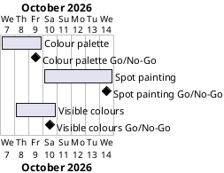

# Project Plan: Hirst Painting

## Metadata
| Key | Value |
| --- | --- |
| ID | PP-001 |
| CrossReference | [BC-001], [SA-001], [MIL-001], [MIL-002], [MIL-003] |
| Language | en |
| Domain | it |

## Version History
| Date | Status | Author | Reviewer | Change | Commit |
| --- | --- | --- | --- | --- | --- |
| 2026-10-08 | Deprecated | Jens Tirsvad Nielsen | S01 | Added gateway MIL-003 Visible Colours: schedule, timeline, scope coverage, dependency and a plan risk | [188b2e9] |
| 2026-10-08 | Accepted | Jens Tirsvad Nielsen | S01 | Recorded the Go decision of MIL-003 | [b385a80] |

---

## Purpose

This plan schedules the three phases of the Hirst painting project, the colour
palette, the spot painting and the visible colours, inside the one-week limit
that [BC-001] sets (2026-10-07 to 2026-10-14). Each phase is a gateway with its
own milestone document, and each gateway ends with a Go/No-Go decision by S01.

## Planning Assumptions

- Week 1 starts 2026-10-07; the plan ends by 2026-10-14, per the Business Case assumption confirmed by S01.
- The baseline documents ([BC-001], [SA-001] and their review records) are finished on 2026-10-07, before the first phase starts.
- Phase length: two to five days, because the work is one small script. The palette phase is shorter because it is the smaller of the two.
- S01 owns every phase and takes every Go/No-Go decision; S01 is the only stakeholder in [SA-001], so communication follows the review gates in that document.
- [MIL-003] was added on 2026-10-08, after [MIL-001] and [MIL-002] had been decided Go, to meet objective O6 of [BC-001]; it runs from 2026-10-08 to 2026-10-10, inside the one-week limit.
- No user stories exist: the program has no user interaction beyond the exit click, so the Stories column is empty.

## Gateway Schedule

| Gateway | Document | Window | Decision date | Owner | Stories | Main deliverable | Milestone |
| --- | --- | --- | --- | --- | --- | --- | --- |
| Colour palette | [MIL-001] | 2026-10-07 to 2026-10-09 | 2026-10-09 | S01 | none | Palette function that returns the reference image's colours without white shades | [MIL-001 milestone] |
| Spot painting | [MIL-002] | 2026-10-10 to 2026-10-14 | 2026-10-14 | S01 | none | Program that draws the 10 by 10 painting and meets SC1 to SC7 of [BC-001] | [MIL-002 milestone] |
| Visible colours | [MIL-003] | 2026-10-08 to 2026-10-10 | 2026-10-10 | S01 | none | Palette without faint colours: every colour has a contrast of 2.0 or more with white (O6, SC8 of [BC-001]) | [MIL-003 milestone] |



## Scope Coverage

| Business Case scope item | Gateway |
| --- | --- |
| One Python program using `turtle`, `random` and `colorgram` | [MIL-001] (`colorgram` part), [MIL-002] (`turtle` and `random` part) |
| Palette extracted from one reference image, white shades removed | [MIL-001] |
| Removal of faint colours from the palette: contrast with white below 2.0 | [MIL-003] |
| Drawing the 10 by 10 dot grid: size, spacing, row change, heading | [MIL-002] |
| Screen handling: `exitonclick`, hidden turtle, pen up, drawing speed | [MIL-002] |
| Framework documents and review records for the plan-first workflow | Finished before each gateway ([BC-001], [SA-001], this plan, the milestone and their reviews); the review of each phase's code is a task in that phase |

## Dependencies

```
Baseline documents → [MIL-001] Colour palette → [MIL-002] Spot painting → [MIL-003] Visible colours
```

[MIL-002] needs the palette function from [MIL-001]. A No-Go on [MIL-001] moves
the start of [MIL-002] by the days needed to rework and re-review; the
one-week limit then has no slack, so S01 decides whether to extend it.

[MIL-003] extends the palette function of [MIL-001] and redraws the painting of
[MIL-002]; both were decided Go on 2026-10-08, so nothing blocks it. A No-Go on
[MIL-003] leaves the accepted program as it is, so the earlier gateways stand.

## Plan Risks

| Risk | Impact | Mitigation |
| --- | --- | --- |
| The reference image is not supplied before the palette phase starts | [MIL-001] cannot start its extraction task; the window of two to three days is lost | The tasks that do not need the image (toolchain check, white filter and its tests) come first; S01 decides on another image if this one stays unavailable |
| A No-Go on the palette phase | [MIL-002] starts late and the one-week limit is missed | The palette phase is the smaller one and ends 2026-10-09, leaving five days for the painting phase |
| Review effort is large compared with the code | Time goes to documents instead of the program | Two phases, plain tasks, no use cases or design artifacts, as set out in [BC-001] |
| The faint-colour filter changes code that [MIL-001] and [MIL-002] already delivered | An earlier test or criterion, such as SC3, could break | [MIL-003] keeps the white-shade filter and its tests untouched and adds the contrast filter beside it; criterion 3 of [MIL-003] requires every earlier test to pass |
| The Project Plan has no quality checklist | The plan is accepted on S01's judgement alone | S01 checks the plan against the one-week limit of [BC-001] and the Go/No-Go criteria of both milestones |

## Open Issues

- **Reference image:** resolved. S01 supplied `assets/20260524_132700.jpg` on 2026-10-07, which completed task 4 of [MIL-001].
- **Project Plan review:** the Project Plan has no quality checklist yet, so it is `Accepted` when S01 says so in chat (done on 2026-10-07, and again on 2026-10-08 for the gateway decisions, for MIL-003 and for its decision); no review record is written for it.
- **Milestone links:** `sync-project.sh --apply` ran on 2026-10-07 and created the two Milestones and issues #1 to #13 on the git host; the Milestone column links to them.

## Gateway Decisions

The Go/No-Go decision of each gateway, taken by its owner (S01) in chat and recorded here by the assistant. The Decision date in the Gateway Schedule is the planned date; the date below is the actual one.

| Gateway | Document | Decision | Decided by | Decision date | Planned date | Basis |
| --- | --- | --- | --- | --- | --- | --- |
| Colour palette | [MIL-001] | Go | S01 | 2026-10-08 | 2026-10-09 | All five Go criteria met: imports and window, 30 colours, no white shade, 18 tests passing, code review RC-005 with verdict `Go`. Pull request [PR 14] merged; Milestone closed on the git host |
| Spot painting | [MIL-002] | Go | S01 | 2026-10-08 | 2026-10-14 | All six Go criteria met: 100 dots in 10 rows of 10, size 20 and 50 apart, colours from the palette, clean result with the window open until a click, drawn in 0.35 seconds, code review RC-006 with verdict `Go`. Pull request [PR 16] merged; Milestone closed on the git host |
| Visible colours | [MIL-003] | Go | S01 | 2026-10-08 | 2026-10-10 | All five Go criteria met: the tests of the contrast measure and the filter pass; the palette has 22 colours, a lowest contrast of 2.56 and no white shade; 77 tests pass with `ruff` and `mypy` clean; a real run drew the painting in 0.35 seconds with 100 dots, no trail and the window open until a click; code review RC-009 with verdict `Go`. Pull request [PR 29] merged; Milestone closed on the git host |

All three decisions came before the planned dates because every Go criterion was already met. The two open decisions on RC-006 (the display requirement of the tests and the pale palette colours) did not block the first two; the open decision on RC-009 (whether `extract_palette` keeps its call to `remove_white_shades`) did not block the third.

---

[BC-001]: ./business-case.md
[SA-001]: ./stakeholder-analysis.md
[MIL-001]: ./milestones/mil-001-palette.md
[MIL-002]: ./milestones/mil-002-painting.md
[MIL-003]: ./milestones/mil-003-visible-colours.md
[MIL-001 milestone]: https://git.tirsystem.com/Tirsvad-Udemy-100-days-of-code/018-hirst-painting/milestone/68
[MIL-002 milestone]: https://git.tirsystem.com/Tirsvad-Udemy-100-days-of-code/018-hirst-painting/milestone/69
[MIL-003 milestone]: https://git.tirsystem.com/Tirsvad-Udemy-100-days-of-code/018-hirst-painting/milestone/74
[PR 14]: https://git.tirsystem.com/Tirsvad-Udemy-100-days-of-code/018-hirst-painting/pulls/14
[PR 16]: https://git.tirsystem.com/Tirsvad-Udemy-100-days-of-code/018-hirst-painting/pulls/16
[PR 29]: https://git.tirsystem.com/Tirsvad-Udemy-100-days-of-code/018-hirst-painting/pulls/29
[188b2e9]: https://git.tirsystem.com/Tirsvad-Udemy-100-days-of-code/018-hirst-painting/commit/188b2e97000d761802d4384c160598f785860a28
[b385a80]: https://git.tirsystem.com/Tirsvad-Udemy-100-days-of-code/018-hirst-painting/commit/b385a801ccd124ce7b492098fef55e895623a577
